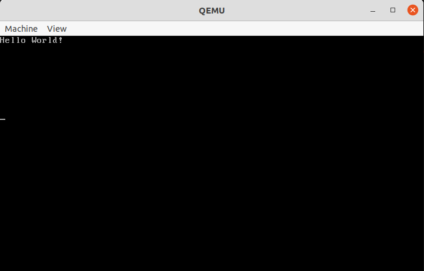

# Operating System

An operating system is system software that manages computer hardware and software resources and provides common services for computer programs.[1]

## Installation

#### *Prerequisities*
You need to have an i386 compiler, assembler and both located in `~/opt/cross/bin`, and qemu-system-i386.

#### Clone this repository using git
> git clone
#### Run **`Makefile`**
> make

QEMU can be run with **`make run`**, and it can be run in debug mode with **`make debug`**

---

Currently, this operating system includes the following implementations:

    - Global Descriptor Table,
    - Memory manager (Physical memory manager, and virtual memory manager),
    - Interrupt Descriptor Table

---
[1] - Wikipedia